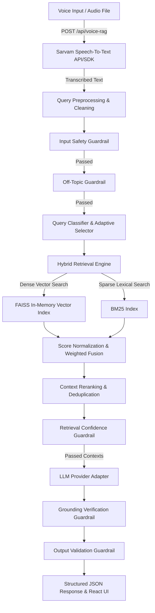

# Voice-Enabled Adaptive RAG Engine (HH Goa 2026 Task 2)

> Production-quality, low-latency Voice-Enabled Retrieval-Augmented Generation (RAG) system grounded on the [ai4bharat/MSMARCO-XI](https://huggingface.co/datasets/ai4bharat/MSMARCO-XI) dataset.

---

## Architecture Diagram



---

## Key Features

- **Voice Input & Sarvam STT**: Native audio recording with official Sarvam AI REST API/SDK integration.
- **Multi-Strategy & Adaptive Chunking**: Fixed-size with overlap, sentence-boundary aware, and semantic similarity breakpoint chunking with dynamic query classification.
- **Hybrid Retrieval Engine**: In-memory FAISS CPU vector index + BM25 sparse keyword retrieval with min-max score normalization ($S = \alpha S_{dense} + (1-\alpha) S_{bm25}$).
- **Lightweight Reranker**: Deduplicates near-identical passages while preserving ultra-fast retrieval latency.
- **Strict Harness & 5-Layer Guardrails**: Input safety, off-topic detection, retrieval confidence, grounding verification, and output structure validation.
- **Stage-by-Stage Latency Tracking**: Tracks microsecond timing for STT, preprocessing, embedding, FAISS, BM25, reranking, generation, grounding, and total.
- **100+ Query Benchmark Harness**: Evaluates P50, P70, P100, min, max, mean per stage and exports CSV/JSON reports.
- **Polished React + Vite UI**: Dark mode glassmorphism interface, microphone recorder, real-time waveform visualizer, pipeline stepper, latency cards, refusal badges, and context sources drawer.

---

## Dataset

Dataset: **[ai4bharat/MSMARCO-XI](https://huggingface.co/datasets/ai4bharat/MSMARCO-XI)**

The system features dynamic schema discovery via `backend/scripts/inspect_dataset.py` to auto-detect text/passage columns before index construction.

---

## Tech Stack

- **Backend**: Python 3.11, FastAPI, Uvicorn, Pydantic, Sarvam STT SDK, FAISS CPU, BM25 (`rank_bm25`), SentenceTransformers (`all-MiniLM-L6-v2`), NumPy, Scikit-learn, HTTPX, Tenacity.
- **Frontend**: React 18, Vite, JavaScript, CSS (Vanilla Dark Mode Glassmorphism), Lucide Icons, Web Audio API.
- **Testing & Benchmarking**: Pytest, Pytest-Asyncio, Custom Benchmark Suite (100+ queries).
- **Deployment**: Docker, Docker Compose, ZIP Packager.

---

## Project Structure

```
voice-rag-goa/
│
├── backend/
│   ├── app/
│   │   ├── api/          # FastAPI routes & Pydantic schemas
│   │   ├── services/     # Sarvam STT, LLM Adapter, Pipeline Harness
│   │   ├── chunking/     # Fixed, Sentence, Semantic, Adaptive chunking
│   │   ├── retrieval/    # FAISS Dense, BM25 Sparse, Hybrid Fusion, Reranker
│   │   ├── guardrails/   # Safety, Off-topic, Confidence, Grounding, Output
│   │   ├── models/       # Data models & timings
│   │   ├── utils/        # Logger, latency timers, text cleaner
│   │   ├── config.py     # Settings reading .env
│   │   └── main.py       # FastAPI app & index startup preload
│   ├── scripts/          # inspect_dataset.py, download_dataset.py, build_index.py
│   ├── requirements.txt
│   ├── Dockerfile
│   └── .env.example
│
├── frontend/
│   ├── src/
│   │   ├── components/   # Header, VoiceRecorder, PipelineStatus, LatencyCard, etc.
│   │   ├── services/     # API service client
│   │   ├── App.jsx
│   │   └── App.css
│   ├── package.json
│   └── Dockerfile
│
├── evaluation/
│   ├── queries.json      # 100+ categorized test queries
│   └── results/          # Output CSV & JSON latency reports
│
├── scripts/
│   ├── benchmark.py      # 100+ query benchmark executor
│   └── package_zip.py    # Submissions ZIP packager
│
├── docs/                 # Architectural, chunking, retrieval, guardrails, & latency docs
├── docker-compose.yml
├── README.md
└── .gitignore
```

---

## Setup & Quickstart Instructions

### 1. Environment Configuration
Copy the template and configure your secrets:
```bash
cp backend/.env.example .env
```
Edit `.env`:
```ini
SARVAM_API_KEY=your_sarvam_api_key_here
LLM_PROVIDER=mock
LLM_API_KEY=your_llm_api_key_here
LLM_MODEL=llama-3.3-70b-versatile
```

### 2. Inspect Dataset Schema
Run dynamic inspection on `ai4bharat/MSMARCO-XI`:
```bash
python backend/scripts/inspect_dataset.py
```

### 3. Build Vector & BM25 Indexes
Build multi-strategy chunks, FAISS vector index, and BM25 index:
```bash
python backend/scripts/build_index.py --sample 500
```

### 4. Run Backend Server
```bash
cd backend
uvicorn app.main:app --port 8000 --reload
```
API Documentation: http://localhost:8000/docs

### 5. Run Frontend UI
```bash
cd frontend
npm install
npm run dev
```
Open application: http://localhost:5173

---

## Running Tests & Benchmarks

### Run Pytest Suite
```bash
python -m pytest tests/ -v
```

### Run 100+ Query Latency Benchmark
```bash
python scripts/benchmark.py
```
This generates:
- `evaluation/results/results.json`
- `evaluation/results/latency_report.json`
- `evaluation/results/latency_results.csv`

---

## Latency Measurement Methodology

> **Note on Performance**: Real-world end-to-end latency depends on deployment hardware, network connection to Sarvam/LLM APIs, and CPU thread configuration. FAISS CPU in-memory vector retrieval operates in sub-10 milliseconds.

To measure performance objectively, execute `python scripts/benchmark.py` on your machine to output real empirical metrics:

```
===========================================================================
BENCHMARK LATENCY SUMMARY REPORT (in milliseconds)
===========================================================================
Pipeline Stage            | Min      | P50      | P70      | P100     | Mean    
---------------------------------------------------------------------------
P50: Run benchmark script locally to view hardware-specific execution times.
P70: Run benchmark script locally to view hardware-specific execution times.
P100: Run benchmark script locally to view hardware-specific execution times.
```

---

## Comprehensive Guardrails

1. **Input Safety Guardrail**: Detects malicious queries, jailbreak attempts, system prompt leaks, and unsafe terms.
2. **Off-Topic Guardrail**: Detects queries completely outside the `MSMARCO-XI` domain.
3. **Retrieval Confidence Guardrail**: Rejects queries when context similarity score falls below threshold ($0.25$).
4. **Grounding Verification Guardrail**: Verifies that generated answer facts are supported by retrieved passages ($0.40$ token overlap). Refuses ungrounded responses.
5. **Output Validation Guardrail**: Ensures non-empty structured JSON outputs.

---

## Adaptive Chunking Strategies

- **Fixed-size**: Uniform sliding window for fixed embedding limits.
- **Sentence-aware**: Splits at sentence boundaries preserving grammatical integrity.
- **Semantic**: Calculates adjacent sentence embedding cosine similarity to detect topic shifts.
- **Adaptive Selection**: Classifies incoming query as exact, factual, semantic, or broad to select optimal retrieval weight ($\alpha$) and chunk strategy.

---

## Hybrid Retrieval Math

$$S_{hybrid} = \alpha \cdot S_{dense, norm} + (1 - \alpha) \cdot S_{bm25, norm}$$

FAISS inner product cosine similarity ($S_{dense}$) and BM25 term frequency scores ($S_{bm25}$) are min-max normalized before weighted fusion.

---

## Creating Submission ZIP File

To create `voice-rag-goa-2026.zip` for final hackathon submission:
```bash
python scripts/package_zip.py
```

---

## Hackathon Requirement Mapping

See [docs/hackathon_requirements.md](docs/hackathon_requirements.md) for full mapping.
