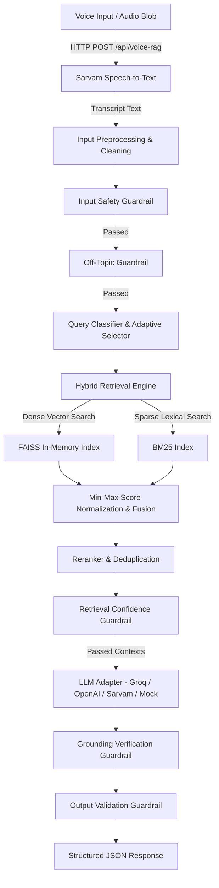

# System Architecture & Pipeline Harness

## Pipeline Flow

## Harness Orchestration & Error Isolation
Every stage in `PipelineHarness` captures microsecond timing (`time.perf_counter()`), catches exceptions, records audit metadata, and returns a predictable structured response payload.
